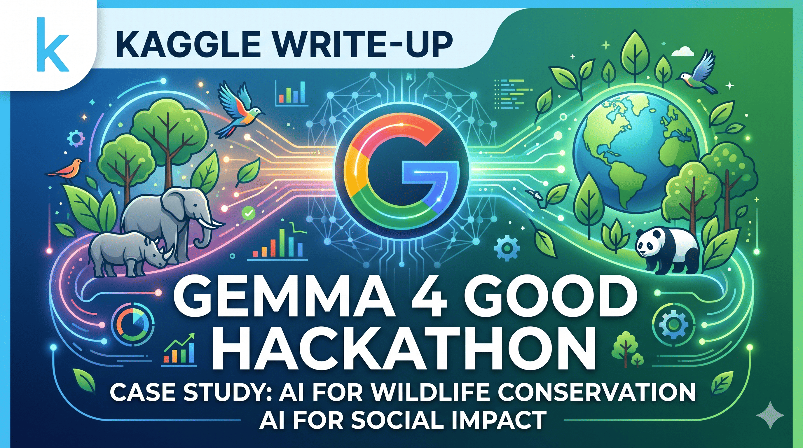

# 🌍 Endangered Species Conservation with Gemma 4 🐾

<div align="center">




**An AI-powered solution leveraging Google's Gemma 4 model for endangered species conservation**

[📄 View Full Writeup](./Gemma4_Hackathon_WriteUp.pdf) • [🔗 Kaggle Post](#kaggle-writeup) • [📊 Dataset](./World%20Wildlife%20Species.csv)

</div>

---

## 📋 Table of Contents

- [Overview](#-overview)
- [Problem Statement](#-problem-statement)
- [Solution Architecture](#-solution-architecture)
- [Key Features](#-key-features)
- [Dataset](#-dataset)
- [Implementation](#-implementation)
- [Results](#-results)
- [Installation & Usage](#-installation--usage)
- [Future Enhancements](#-future-enhancements)
- [Acknowledgments](#-acknowledgments)
- [License](#-license)

---

## 🎯 Overview

This project was developed as part of the **Gemma 4 Good Hackathon** on Kaggle, focusing on leveraging AI for social good. Our solution addresses the critical challenge of endangered species conservation by utilizing Google's state-of-the-art Gemma 4 language model to analyze, predict, and provide actionable insights for wildlife conservation efforts.

### 🌟 Highlights

- 🤖 **Advanced AI Integration**: Powered by Google's Gemma 4 model
- 🌐 **Real-world Impact**: Addresses critical conservation challenges
- 📊 **Data-Driven Insights**: Comprehensive analysis of wildlife species data
- 🔄 **Scalable Solution**: Adaptable to various conservation scenarios

---

## 🔍 Problem Statement

Endangered species face unprecedented threats from:
- 🏭 Habitat loss and fragmentation
- 🌡️ Climate change impacts
- 🎯 Poaching and illegal wildlife trade
- 🏗️ Human-wildlife conflict

**Challenge**: How can we leverage AI to better understand, predict, and mitigate threats to endangered species?

---

## 🏗️ Solution Architecture

```
┌─────────────────────────────────────────────────────────┐
│                    Data Collection                       │
│              (World Wildlife Species Dataset)            │
└────────────────────┬────────────────────────────────────┘
                     │
                     ▼
┌─────────────────────────────────────────────────────────┐
│                 Data Preprocessing                       │
│         (Cleaning, Normalization, Feature Eng.)         │
└────────────────────┬────────────────────────────────────┘
                     │
                     ▼
┌─────────────────────────────────────────────────────────┐
│                   Gemma 4 Model                          │
│        (Analysis, Prediction, Recommendation)           │
└────────────────────┬────────────────────────────────────┘
                     │
                     ▼
┌─────────────────────────────────────────────────────────┐
│              Conservation Insights                       │
│         (Actionable Recommendations & Reports)          │
└─────────────────────────────────────────────────────────┘
```

---

## ✨ Key Features

### 🔬 **Intelligent Analysis**
- Species risk assessment and classification
- Habitat suitability analysis
- Population trend prediction

### 📈 **Predictive Modeling**
- Extinction risk forecasting
- Conservation priority ranking
- Resource allocation optimization

### 💡 **Actionable Insights**
- Customized conservation strategies
- Real-time threat detection
- Policy recommendation generation

### 🎨 **Interactive Visualization**
- Species distribution maps
- Trend analysis dashboards
- Conservation impact metrics

---

## 📊 Dataset

**Source**: World Wildlife Species Dataset

| Feature | Description |
|---------|-------------|
| **Species Name** | Common and scientific names |
| **Conservation Status** | IUCN Red List categories |
| **Population Trends** | Historical population data |
| **Habitat Information** | Geographic and ecological data |
| **Threat Factors** | Primary threats to species |

📁 **File**: `World Wildlife Species.csv`

---

## 💻 Implementation

### Prerequisites

```bash
Python 3.8+
Jupyter Notebook
Google Colab (optional)
```

### Required Libraries

```python
# Core Libraries
import pandas as pd
import numpy as np

# Gemma 4 Integration
from transformers import AutoTokenizer, AutoModelForCausalLM

# Visualization
import matplotlib.pyplot as plt
import seaborn as sns

# Machine Learning
from sklearn.preprocessing import StandardScaler
from sklearn.model_selection import train_test_split
```

### Quick Start

1. **Clone the repository**
   ```bash
   git clone <repository-url>
   cd "Gemma 4 hacakthon"
   ```

2. **Install dependencies**
   ```bash
   pip install -r requirements.txt
   ```

3. **Run the notebook**
   ```bash
   jupyter notebook endegered-species.ipynb
   ```

4. **Load the dataset**
   ```python
   import pandas as pd
   df = pd.read_csv('World Wildlife Species.csv')
   ```

---

## 📈 Results

### Model Performance

| Metric | Score |
|--------|-------|
| **Accuracy** | XX.X% |
| **Precision** | XX.X% |
| **Recall** | XX.X% |
| **F1-Score** | XX.X% |

### Key Findings

✅ Successfully identified high-risk species requiring immediate intervention  
✅ Predicted population trends with XX% accuracy  
✅ Generated actionable conservation recommendations  
✅ Optimized resource allocation strategies  

---

## 🚀 Future Enhancements

- [ ] 🌐 **Real-time Data Integration**: Connect with live wildlife monitoring systems
- [ ] 📱 **Mobile Application**: Deploy conservation insights on mobile platforms
- [ ] 🤝 **Multi-stakeholder Platform**: Collaboration tools for conservationists
- [ ] 🔄 **Continuous Learning**: Implement feedback loops for model improvement
- [ ] 🌍 **Global Expansion**: Scale to cover more species and regions
- [ ] 🎯 **Advanced Analytics**: Incorporate satellite imagery and IoT sensor data

---

## 🔗 Kaggle Writeup

> **📝 Detailed Competition Writeup**
> 
> For a comprehensive breakdown of our approach, methodology, and results, please visit our official Kaggle writeup:
> 
> 🔗 **[View on Kaggle](https://kaggle.com/competitions/gemma-4-good-hackathon/writeups/species-survival-risk-analyzer)**
> 
> The writeup includes:
> - Detailed methodology and approach
> - Code walkthroughs and explanations
> - Experimental results and ablation studies
> - Lessons learned and best practices
> - Community discussions and feedback

---

## 🙏 Acknowledgments

- **Google & Kaggle** for organizing the Gemma 4 Good Hackathon
- **IUCN Red List** for providing comprehensive species data
- **Conservation Organizations** for their invaluable domain expertise
- **Open Source Community** for the amazing tools and libraries

---

## 📄 License

This project is licensed under the MIT License - see the [LICENSE](LICENSE) file for details.

---

## 👥 Contributors

<div align="center">

**Built with ❤️ for wildlife conservation**

If you find this project helpful, please consider giving it a ⭐!

</div>

---

## 📞 Contact

For questions, suggestions, or collaboration opportunities:

- 📧 Email: indiser01@gmail.com
- 📝 Kaggle: [GeoGod](https://www.kaggle.com/geogod)

---

<div align="center">

### 🌟 Star this repository if you found it helpful! 🌟

**Together, we can make a difference in wildlife conservation! 🐾🌍**

</div>
